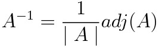
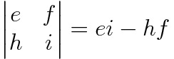
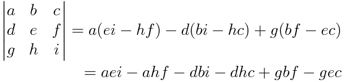

# Piloting Method

- Initialisation
  - Initialise up vector (initially a guess, updated over iterations)

- Normal operation
  - Get ship direction vector (Sample ISAN pos in time)
  - Get destination vector (Current ISAN pos -> Desired ISAN pos)
  - Transform destination vector into ship-oriented space (SO-space)
    - ensure direction & up are normalised
    - get their cross product to form basis
    - use basis set to transform
  - Use coords of destination vector in SO-space on ORN-plane (plane perp to direction at 0,0,0) to decide direction for thrust (opposite if dest is behind us (check 3rd coord))
  - thrust in that direction (maybe only move in one dir at a time)

- Update Up
  - Based on previous thrust attempt & how it moved the destination on the orn plane
  - rotate up around direction vector by correct angle to account for this

- Calibration
  - Keep track of how much we want to move vs how much we actually move, use this to calibrate thrust such that we move closer to correct ammount

- Averaging
  - Maybe average ISAN positions over time as to avoid jitter

