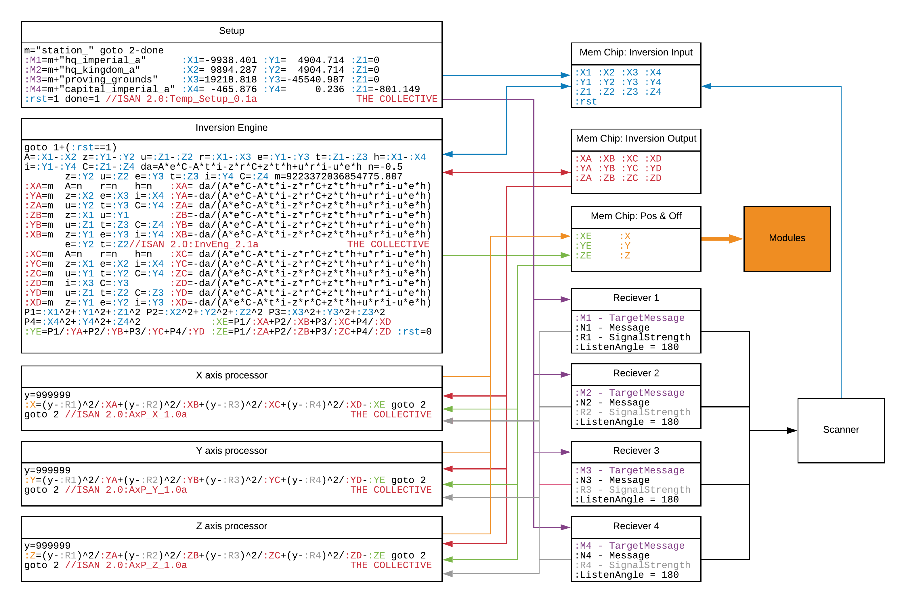
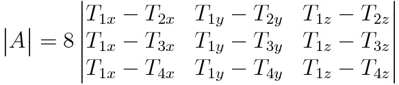

# Under the hood of ISAN v2
*An infinitely expandable multilateration solution for Starbase in yolol.*

## TOC
 - [Intro](#Intro)
 - [Architecture](#The-architecture-at-a-glance)
 - [Some Context](#Some-context)
 - [Getting Mathy](#Getting-Mathy)
   - [The fruits of getting mathy](#the-fruits-of-getting-mathy)
 - [The Inversion Engine](#The-Inversion-Engine)
   - [Step 1: The Determinant](#Step-1:-The-Determinant)
   - [Step 2: the Adjugate](#Step-2:-the-Adjugate)
   - [Step 3: Yololification](#Step-3:-Yololification)
 - [Summary](#Summary)
 - [Next Steps](#Next-steps)


## Intro

Given Frozenbyte's very interesting decision to hide global coordinates from players in favour of realism - y'know, relativity and all - us Endos are faced with some interesting questions: **Where the fuck am I? and where the fuck are you?**

Maybe we can throw some math & code at those questions, hoping for the best.

## The architecture at a glance
(Don't worry, this is explained ***at length*** below)


## Some context

So, we can't just give F3 a little smack & have our coordinates pop right up. *However*, the dev's were nice enough to throw in these three snazzy little devices:
 
 - [Radio transmitters](https://wiki.starbasegame.com/index.php/Radio_transmitters) - Broadcasts a message on a given frequency
 - [Navigation receivers](https://wiki.starbasegame.com/index.php/Navigation_receivers) - Receives a message (Optional filtering by frequency and/or message)
 - [YOLOL Chips](https://wiki.starbasegame.com/index.php/YOLOL_Chip) - Can execute [YOLOL](https://wiki.starbasegame.com/index.php/YOLOL) to process the information received

You can check out those respective links to their own official wiki pages, but all we really need to know is that:
- There are some transmitters, with fixed positions in space, fixed messages & constant frequency.
- Our receiver(s) can filter for one of those messages
- Receivers report the "signal strength" of the signal it is receiving.

## Getting Mathy

The best part about that last point, is that "Signal Strength" is directly related to distance (from the transmitter to our receiver) by the beautifully simple:


s: signal strength  | r: distance

So this means, if we have a receiver on our ship, we can easily measure the distance to any transmitter we like. Using this in combination with [the measured coordinates of the transmitters](https://wiki.starbasegame.com/index.php/Radio_transmitters#Known_station_transmitters), we can use our receiver to give us a sphere of potential points we occupy (Inaccuracy technically makes this a shell but whatever). Put into some math, where T is the transmitter position & (X,Y,Z) is ours:


A sphere is better than no idea (we have dropped from three dimentiosn of uncertanty to two!), but it's not really great. That said, it's trivial to now measure to another station, which will give us another sphere of points we should be in. Since we've just measured ourselves to be in two different spheres, we know we must be in the intersection of those & we've refined our search to a circle (technically a weird-fat-squarish-torus) of points. And so we keep going, another measurement gives us two points & a final measurement singles out one of those. **BOOM, we've done it:** just measure distance to four transmitters & work out the intersection of those four spheres.

Well, that last bit is actually kinda tricky, made a little worse by the need to fit it all into yolol... But we'll do it in the real world first. Our four spheres look like so:


Where (X,Y,Z) is still just our position, {T1, T2, T3, T4} are x,y,z positions of the four transmitters & {R1,R2,R3,R4} are the distances we've measured to each of these transmitters.

If we take each of these equations & expand those squared terms (I'll just show the first sphere as an example), we can re-group them to get:


Doing this to all three equations yields:


Hopefully you can see that this can be written more simply in matrix form as follows (if not just google "Matrix Multiplication & Matrix Equations" to keep following along, optionally, hit up Azurethi#0789 for a math lesson): 


And this instantly simplifies to:


where A is our big 4x4 matrix, R is the measured distances (**R**adii) & P is the distance of each transmitter from the origin (magnitude of it's **P**osition vector) and finally X is what we want to solve for.

To solve this, we simply need to multiply both sides by the inverse of A from the right. This gives:


So overall, we have our position (X), now in terms of a bunch of "transmitter-constant" variables & our measured distances. And by "transmitter-constant" I just mean, for a given set of four transmitters, if we calculate these values, they'll stay constant until we want to swap to another set of four transmitters. 

### the fruits of getting mathy

***So now***, we can pre-calculate the Inverse of A and p & just do basic arithmetic to get our position quickly. This is the main cause of the speed-up between ISANv1 & ISANv2. Furthermore, this pre-calculation *could* be done out of game, fixing the ship to only use the four starter transmitters ***OR*** if we can devise a method of inverting that original 4x4 A matrix in game we'd be able to use *any* four transmitters with known position, to measure our position (doesn't even matter if this 4x4 inversion is slow, since it'll only be used when acquiring a new set of 4 transmitters).

Showing how constants can be arranged to calculate the position on each axis, by defining A inverse and A inverse * P:


![\overrightarrow{x}=A^{-1}(\overrightarrow{r}-\overrightarrow{p})\\
\overrightarrow{x}=A^{-1}\overrightarrow{r}-A^{-1}\overrightarrow{p}\\
A^{-1} =  \begin{bmatrix}
W_a & W_b & W_c & W_d \\
X_a & X_b & X_c & X_d \\ 
Y_a & Y_b & Y_c & Y_d \\ 
Z_a & Z_b & Z_c & Z_d
\end{bmatrix}\\
A^{-1}\overrightarrow{p}=\begin{bmatrix}
W_e \\ X_e \\ Y_e \\ Z_e 
\end{bmatrix}\\
\overrightarrow{x}=\begin{bmatrix}
W_a & W_b & W_c & W_d \\
X_a & X_b & X_c & X_d \\ 
Y_a & Y_b & Y_c & Y_d \\ 
Z_a & Z_b & Z_c & Z_d
\end{bmatrix}\begin{bmatrix}r_{1}^2\\r_{2}^2\\r_{3}^2\\r_{4}^2\end{bmatrix}-\begin{bmatrix}
W_e \\ X_e \\ Y_e \\ Z_e 
\end{bmatrix}\\
](img/eqn9.png)

Then, with those constants a, b, c, d & e for each axis W, X, Y & Z calculated. Where the W axis is just X^2 + Y^2 + Z^2, and could be used as a double check on accuracy, but this is more usefull when using more reference points & the least squares method (since the resultant A matrix wouldn't be square & so dosen't have an inverse without it) so we'll ignore W for now.

We can simply multiply out the matrix equation, to yield individual equations for X, Y & Z: 


However, since these constants become very small in practice due to the scale of Starbase, yolol would be unable to store them with it's maximum precision of 0.001. But this issue can be resolved by simply redefining the a,b,c & d constants to be one over their original definition. Since we're moving into the start of yolol teritory, we'll also substitute in our equation for converting reciever signal strength into distance, which gives the final form of our axis equations: 


which you can see directly reflected in the yolol form (this is for X only): 
```c
y=999999
:X=(y-:R1)^2/:XA+(y-:R2)^2/:XB+(y-:R3)^2/:XC+(y-:R4)^2/:XD-:XE goto 2
goto 2 //ISAN 2.0:AxP_X_2.1a                            THE COLLECTIVE
```

## The Inversion Engine

Lovely! We've now got this completely general purpose "axis processor", but it needs those pesky constants. Which we know from above, come directly from the inverse of A (& some multiplying with P), so first off, how do we even do that?

There are many ways to calculate the inverse of a matrix, it's used a lot. However we're going to do it in a kind of weird-ish old fashion way (just because it works better with yolol). The whole equation we're going to need to hash out in yolol is as follows:


Where |A| is the *determinant* of A and adj(A) is the *Adjugate* of A.

This looks simple at first, but it's going to get more complicated before we manage to simplify it down. 

Some Rapid fire definitions before we start:

 - "Transposing" a matrix, is just mirroring it over it's leading (\\) diagonal.
 - A "Sub-Matrix" (Aij) is a smaller matrix formed by removing the ith row & the jth column from a larger matrix (A).
 - The "comatrix" of a matrix is a matrix of the determinants of all of the matrices' submatrices (with alternating signs)
 - The Adjugate of a matrix is the transpose of the comatrix of that matrix


### Step 1: The Determinant

The determinant of a matrix can be defined recursively as the determinant's of a set of it's submatrices with a column of factors & alternating signs. For example:


(Take a moment to see how I got those smaller 2x2 submatrices from the larger 3x3 matrix, by removing the row & column that the submatrices' factors (a, d & g) are in.)

Then since the determinant of a single element matrix, is just that element:


so for that original 3x3:


This fits quite nicely into a yolol line (70 char limit, 2nd line is just showing this limit) like so:
```c
det=(a*e*i-a*h*f-d*b*i-d*h*c+g*b*f-g*e*c)
----+----|----+----|----+----|----+----|----+----|----+----|----+----|
```
While this is great, as we need a to do this 16 times to get the entire cofactor matrix, we still need to get the determinant of the entire 4x4 matrix. Using the same recursive steps, just starting with a 4x4, we get this mess:

```c
det=(a*f*k*p - a*f*l*o - a*g*j*p + a*g*l*n + a*h*j*o - a*h*k*n - b*e*k*p + b*e*l*o + b*g*i*p - b*g*l*m - b*h*i*o + b*h*k*m + c*e*j*p - c*e*l*n - c*f*i*p + c*f*l*m + c*h*i*n - c*h*j*m - d*e*j*o + d*e*k*n + d*f*i*o - d*f*k*m - d*g*i*n + d*g*j*m)
```

Which is pretty far from fitting into our 70 char limit. There's a nice trick to deal with this tho. I'm just going to ask you to [trust me](" "you could use just the equations here to prove this for yourself") when I tell you that if we subtract one row of a matrix from another row in the same matrix, the determinant remains unchanged. This dosen't change the mess that is the 4x4 general case determinant, but if we recall that the A matrix that we're trying to find the determinant of always has a left column full of ones. So lets subtract the first row from all the others like so:


This initially looks more complicated at a glance, but since 3 of the left column are 0, the determenant expands like so:

![\begin{vmatrix}1 & -2T_{1x} & -2T_{1y} & -2T_{1z}\\0 & 2T_{1x}-2T_{2x} & 2T_{1y}-2T_{2y} & 2T_{1z}-2T_{2z}\\0 & 2T_{1x}-2T_{3x} & 2T_{1y}-2T_{3y} & 2T_{1z}-2T_{3z}\\0 & 2T_{1x}-2T_{4x} & 2T_{1y}-2T_{4y} & 2T_{1z}-2T_{4z}\end{vmatrix}=1 \begin{vmatrix}2T_{1x}-2T_{2x} & 2T_{1y}-2T_{2y} & 2T_{1z}-2T_{2z}\\2T_{1x}-2T_{3x} & 2T_{1y}-2T_{3y} & 2T_{1z}-2T_{3z}\\2T_{1x}-2T_{4x} & 2T_{1y}-2T_{4y} & 2T_{1z}-2T_{4z}\end{vmatrix} \underbrace{- 0 \begin{vmatrix} {I} \end{vmatrix}+ 0 \begin{vmatrix} {J} \end{vmatrix}- 0 \begin{vmatrix} {K} \end{vmatrix}}](img/eqn17.png)

Where I, J & K would be other submatrices, but I've excluded them as you can see they just end up being multiplied by those zeros we created. This leaving the entire underbraced section as just zero, reducing our 4x4 determinant to a 3x3 determinant.

 Another fun trick, is that if we divide a row by some constant, it'll divide the entire determinant by that constant. So we could divide all three rows by 2, & multiply by 8 to get the determinant back to what it was. Giving us: 



Where we can just load each value in to a->i & use our 3x3 determinant formula (which actually fits in yolol) to get the determinant of A

### Step 2: the Adjugate

Per our list of definitions, the Adjugate of a matrix is the transpose of it's comatrix. Since "Transposing" in yolol, can be done by just renaming variables, we just need to focus on the cofactor matrix. 

The cofactor matrix, is a matrix of the determinants of all the submatrices of the original matrix. For example:

![comatrix(\begin{bmatrix}a&b&c&d\\e&f&g&h\\i&j&k&l\\m&n&o&p\\\end{bmatrix})=\begin{bmatrix}\begin{vmatrix}f&g&h\\j&k&l\\n&o&p\\\end{vmatrix}&-\begin{vmatrix}e&g&h\\i&k&l\\n&o&p\\\end{vmatrix}&\begin{vmatrix}e&f&h\\i&j&l\\m&n&p\\\end{vmatrix}&-\begin{vmatrix}e&f&g\\i&j&k\\m&n&o\\\end{vmatrix}\\-\begin{vmatrix}b&c&d\\j&k&l\\n&o&p\\\end{vmatrix}&\begin{vmatrix}a&c&d\\i&k&l\\m&o&p\\\end{vmatrix}&-\begin{vmatrix}a&b&d\\i&j&l\\m&n&p\\\end{vmatrix}&\begin{vmatrix}e&f&g\\i&j&k\\m&n&o\\\end{vmatrix}\\\begin{vmatrix}b&c&d\\f&g&h\\n&o&p\\\end{vmatrix}&-\begin{vmatrix}a&c&d\\e&g&h\\m&o&p\\\end{vmatrix}&\begin{vmatrix}a&b&d\\e&f&h\\m&n&p\\\end{vmatrix}&-\begin{vmatrix}a&b&c\\e&f&g\\m&n&o\\\end{vmatrix}\\-\begin{vmatrix}b&c&d\\f&g&h\\j&k&l\\\end{vmatrix}&\begin{vmatrix}a&c&d\\e&g&h\\i&k&l\\\end{vmatrix}&-\begin{vmatrix}a&b&d\\e&f&h\\i&j&l\\\end{vmatrix}&\begin{vmatrix}a&b&c\\e&f&g\\i&j&k\\\end{vmatrix}\end{bmatrix}](img/eqn19.png)

Now this looks bad. But you might notice something: Moving from one submatrix to an adjacent submatrix only changes three values. So our yolol could just look like this:
```c
//Setup first submatrix
a=:S b=:S c=:S d=:S e=:S f=:S g=:S h=:S i=:S
//get the determinant (wont fit on same line as initial setup)
Cofactor11=(a*e*i-a*h*f-d*b*i-d*h*c+g*b*f-g*e*c)
//Move to next submatrix (only need to update 3 vars)
//AND now the det calculation fits on the same line
a=:S b=:S d=:S Cofactor12=(a*e*i-a*h*f-d*b*i-d*h*c+g*b*f-g*e*c)
----+----|----+----|----+----|----+----|----+----|----+----|----+----|
```

Where `:S` is just some placeholder for the values of the 4x4 matrix we need to load. We're now ready to pull all this inverse stuff together in yolol.

### Step 3: Yololification

Let me define some variables for use in YOLOL, since we can't use subscripts anymore: (# just represents "some number")

Label(s) | Description | Replaces
-|-|- 
`:X`, `:Y`, `:Z`|The position of our ship | -
`:X#`, `:Y#`, `:Z#`|The position of transmitter #|T_{#x}, T_{#y} & T_{#z}
`a`,`b`,`c`, `d`,`e`,`f` ,`g`,`h`,`i`| Space to store our 3x3 matrix, that our determinant equation gets the determinant of. Our **"Determinant Matrix"** | matrix from our determinant equation
`dA`| The determinant of the entire A matrix | `|A|`
`:C##`| A single element of the Cofactor matrix, the two numbers represent the elements Row, then Column. Each index runs from 1 to 4, 11 being top left, 4,4 being bottom right. | Cofactor matrix
`:XA`,`:XB`,`:XC`,`:XD` | Axis scale constants (will also have these for Y & Z), still defined as `dA/:C##`, where `:C##` is the relevant cofactor matrix element. (Note that this is the same as one over a matrix element from Inverse A, or original re-definition of these)| -
`:XE` | Axis Offset constant, derived from Inverse A * P (will also have this for Y & Z)| -

Our goal here: Take 4 arbitrary transmitter positions:
- `:X1`,`:Y1`,`:Z1`
- `:X2`,`:Y2`,`:Z2` 
- `:X3`,`:Y3`,`:Z3` 
- `:X4`,`:Y4`,`:Z4`

and calculate the axis constants :
- `:XA`, `:XB`, `:XC`, `:XD`, `:XE`
- `:YA`, `:YB`, `:YC`, `:YD`, `:YE`
- `:ZA`, `:ZB`, `:ZC`, `:ZD`, `:ZE`

(remember we've dropped W axis for this system, since it's useless unless we have more that 4 reference points.)

The method:
```
  1. Find Inverse A  (for A,B,C & D constants)
    1.1 Find the determinant of A
    1.2 Find the determinant of each submatrix of A
    1.3 Divide each of these by the Determinant of A to get the elements of A inverse
    1.4 Invert these to get our A,B,C * D constants

  2. Find Inverse A * P (for E constants)
    2.1 Calculate the Distance of each transmitter from (0,0,0)
    2.2 Multiply each of these with the relevent elements from Inverse A to find each E constant
```
```c
//1.1: Load the determinant matrix & calculate determinant
a=:X1-:X2 b=:Y1-:Y2 c=:Z1-:Z2 d=:X1-:X3 e=:Y1-:Y3 f=:Z1-:Z3 g=:X1-:X4
h=:Y1-:Y4 i=:Z1-:Z4 dA=8*(a*e*i-a*f*h-b*d*i+b*f*g+c*d*h-c*e*g)
//1.2: Load the first submatrix of A into our determinant matrix
a=:X2 b=:Y2 c=:Z2 d=:X3 e=:Y3 f=:Z3 g=:X4 h=:Y4 i=:Z4
//1.2: Calculate the determinant of this submatrix
//      NB: since we loaded the coords & not -2* the coords,
//          we need to scale back up by -8 (-2^3)
                  :C11=-8*(a*e*i-a*f*h-b*d*i+b*f*g+c*d*h-c*e*g)
//1.2: Swap out three values to move to an adjacent submatrix
//      Then recalculate determinant
a=-0.5 d=a g=a    :C21= 8*(a*e*i-a*f*h-b*d*i+b*f*g+c*d*h-c*e*g)
//1.2 Repeat the above for the rest of the submatrices
b=:X2 c=:X3 d=:X4 :C31=-8*(a*e*i-a*f*h-b*d*i+b*f*g+c*d*h-c*e*g)
c=:Y2 f=:Y3 i=:Y4 :C41= 8*(a*e*i-a*f*h-b*d*i+b*f*g+c*d*h-c*e*g)
b=:X1 c=:Y1       :C42=-8*(a*e*i-a*f*h-b*d*i+b*f*g+c*d*h-c*e*g)
c=:Z1 f=:Z3 i=:Z4 :C32= 8*(a*e*i-a*f*h-b*d*i+b*f*g+c*d*h-c*e*g)
b=:Y1 e=:Y3 h=:Y4 :C22=-8*(a*e*i-a*f*h-b*d*i+b*f*g+c*d*h-c*e*g)
a=:X1 d=:X3 g=:X4 :C12= 8*(a*e*i-a*f*h-b*d*i+b*f*g+c*d*h-c*e*g)
d=:X2 e=:Y2 f=:Z2 :C13=-8*(a*e*i-a*f*h-b*d*i+b*f*g+c*d*h-c*e*g)
a=-0.5 d=a g=a    :C23= 8*(a*e*i-a*f*h-b*d*i+b*f*g+c*d*h-c*e*g)
b=:X1 e=:X2 h=:X4 :C33=-8*(a*e*i-a*f*h-b*d*i+b*f*g+c*d*h-c*e*g)
c=:Y1 f=:Y2 i=:Y4 :C43= 8*(a*e*i-a*f*h-b*d*i+b*f*g+c*d*h-c*e*g)
h=:X3 i=:Y3       :C44=-8*(a*e*i-a*f*h-b*d*i+b*f*g+c*d*h-c*e*g)
c=:Z1 f=:Z2 i=:Z3 :C34= 8*(a*e*i-a*f*h-b*d*i+b*f*g+c*d*h-c*e*g)
b=:Y1 e=:Y2 h=:Y3 :C24=-8*(a*e*i-a*f*h-b*d*i+b*f*g+c*d*h-c*e*g)
a=:X1 d=:X2 g=:X3 :C14= 8*(a*e*i-a*f*h-b*d*i+b*f*g+c*d*h-c*e*g)
```

Since each one of these elements of the comatrix, directly related to one of our A,B,C or D constants by ``da/:C##`` just slightly modify this code to directly calculate our constants, implementing `1.3 & 1.4`! Also, since da & :C## both share a factor of 8, we can just divide that out. *Also*, we can just ignore some of the Comatrix elements as they refer to the W axis constants. I'll also add a constant `n` for -0.5 since that shows up in the whole left hand column of A (remember, these used to be 1's but we've divided all rows by -2). This update frees up some space at the bottom, so we'll add in the E constant calculations as well.

```c
a=:X1-:X2 b=:Y1-:Y2 c=:Z1-:Z2 d=:X1-:X3 e=:Y1-:Y3 f=:Z1-:Z3 g=:X1-:X4
h=:Y1-:Y4 i=:Z1-:Z4 da=a*e*i-a*f*h-b*d*i+b*f*g+c*d*h-c*e*g n=-0.5
b=:Y2 c=:Z2 e=:Y3 f=:Z3 h=:Y4 i=:Z4
a=n   d=n   g=n   :XA= da/(a*e*i-a*f*h-b*d*i+b*f*g+c*d*h-c*e*g)
b=:X2 e=:X3 h=:X4 :YA=-da/(a*e*i-a*f*h-b*d*i+b*f*g+c*d*h-c*e*g)
c=:Y2 f=:Y3 i=:Y4 :ZA= da/(a*e*i-a*f*h-b*d*i+b*f*g+c*d*h-c*e*g)
b=:X1 c=:Y1       :ZB=-da/(a*e*i-a*f*h-b*d*i+b*f*g+c*d*h-c*e*g)
c=:Z1 f=:Z3 i=:Z4 :YB= da/(a*e*i-a*f*h-b*d*i+b*f*g+c*d*h-c*e*g)
b=:Y1 e=:Y3 h=:Y4 :XB=-da/(a*e*i-a*f*h-b*d*i+b*f*g+c*d*h-c*e*g)
e=:Y2 f=:Z2
a=n   d=n   g=n   :XC= da/(a*e*i-a*f*h-b*d*i+b*f*g+c*d*h-c*e*g)
b=:X1 e=:X2 h=:X4 :YC=-da/(a*e*i-a*f*h-b*d*i+b*f*g+c*d*h-c*e*g)
c=:Y1 f=:Y2 i=:Y4 :ZC= da/(a*e*i-a*f*h-b*d*i+b*f*g+c*d*h-c*e*g)
h=:X3 i=:Y3       :ZD=-da/(a*e*i-a*f*h-b*d*i+b*f*g+c*d*h-c*e*g)
c=:Z1 f=:Z2 i=:Z3 :YD= da/(a*e*i-a*f*h-b*d*i+b*f*g+c*d*h-c*e*g)
b=:Y1 e=:Y2 h=:Y3 :XD=-da/(a*e*i-a*f*h-b*d*i+b*f*g+c*d*h-c*e*g)
//2.1: Calculate the distance of each transmitter from (0,0,0)
P1=:X1^2+:Y1^2+:Z1^2 P2=:X2^2+:Y2^2+:Z2^2 P3=:X3^2+:Y3^2+:Z3^2
P4=:X4^2+:Y4^2+:Z4^2
//2.2: divide by relevent elements of Inverse A to get E consts
:XE=P1/:XA+P2/:XB+P3/:XC+P4/:XD
:YE=P1/:YA+P2/:YB+P3/:YC+P4/:YD :ZE=P1/:ZA+P2/:ZB+P3/:ZC+P4/:ZD
```

This is *almost* everything we need, however there's one more problem: Sometimes, some of the original multiplicative axis constants are supposed to be 0, which would make the inverted ones we're using here jump to infinity. In reality, the determinant of the related submatrix is the part that becomes zero, we divide by this causing an exception which just skips the rest of the line, not setting our constant. This could be a big issue, as whatever the previous constant was, will just stay there without being updated, which will of course through off our axis calculations. 

This is a fairly easy fix tho, if we just set the constant to a huge number at the start of the line, this will be close enough to infinity for our purposes (it'll divide out any distance returned by the recievers to less that yolol's 0.001 precision limit, so it effectively is infinity as far as yolol cares). So we'll add in a constant for yolol's max int ``m=9223372036854775.807`` & throw in those overwrites.

We'll also add some yolol to halt the ship & wait for a "go" signal on `:rst` ("**r**e**s**e**t**"). Here I've copied the official current version, which is the exact same as above, with the updates I've described & some watermarking.
```c
goto 1+(:rst==1)
A=:X1-:X2 z=:Y1-:Y2 u=:Z1-:Z2 r=:X1-:X3 e=:Y1-:Y3 t=:Z1-:Z3 h=:X1-:X4
i=:Y1-:Y4 C=:Z1-:Z4 da=A*e*C-A*t*i-z*r*C+z*t*h+u*r*i-u*e*h n=-0.5
:XA=m  z=:Y2 u=:Z2 e=:Y3 t=:Z3 i=:Y4 C=:Z4 m=9223372036854775.807
:YA=m  A=n   r=n   h=n   :XA= da/(A*e*C-A*t*i-z*r*C+z*t*h+u*r*i-u*e*h)
:ZA=m  z=:X2 e=:X3 i=:X4 :YA=-da/(A*e*C-A*t*i-z*r*C+z*t*h+u*r*i-u*e*h)
:ZB=m  u=:Y2 t=:Y3 C=:Y4 :ZA= da/(A*e*C-A*t*i-z*r*C+z*t*h+u*r*i-u*e*h)
:YB=m  z=:X1 u=:Y1       :ZB=-da/(A*e*C-A*t*i-z*r*C+z*t*h+u*r*i-u*e*h)
:XB=m  u=:Z1 t=:Z3 C=:Z4 :YB= da/(A*e*C-A*t*i-z*r*C+z*t*h+u*r*i-u*e*h)
       z=:Y1 e=:Y3 i=:Y4 :XB=-da/(A*e*C-A*t*i-z*r*C+z*t*h+u*r*i-u*e*h)
:XC=m  e=:Y2 t=:Z2 //ISAN 2.0:InvEng_2.1a               THE COLLECTIVE
:YC=m  A=n   r=n   h=n   :XC= da/(A*e*C-A*t*i-z*r*C+z*t*h+u*r*i-u*e*h)
:ZC=m  z=:X1 e=:X2 i=:X4 :YC=-da/(A*e*C-A*t*i-z*r*C+z*t*h+u*r*i-u*e*h)
:ZD=m  u=:Y1 t=:Y2 C=:Y4 :ZC= da/(A*e*C-A*t*i-z*r*C+z*t*h+u*r*i-u*e*h)
:YD=m  i=:X3 C=:Y3       :ZD=-da/(A*e*C-A*t*i-z*r*C+z*t*h+u*r*i-u*e*h)
:XD=m  u=:Z1 t=:Z2 C=:Z3 :YD= da/(A*e*C-A*t*i-z*r*C+z*t*h+u*r*i-u*e*h)
       z=:Y1 e=:Y2 i=:Y3 :XD=-da/(A*e*C-A*t*i-z*r*C+z*t*h+u*r*i-u*e*h)
P1=:X1^2+:Y1^2+:Z1^2 P2=:X2^2+:Y2^2+:Z2^2 P3=:X3^2+:Y3^2+:Z3^2
P4=:X4^2+:Y4^2+:Z4^2 :XE=P1/:XA+P2/:XB+P3/:XC+P4/:XD
:YE=P1/:YA+P2/:YB+P3/:YC+P4/:YD :ZE=P1/:ZA+P2/:ZB+P3/:ZC+P4/:ZD :rst=0
```

## Summary

So we now have a system, that can take any four transmitter coordinates as input and calculate the constants necessary to update our position in a single tick.

We can use a simple setup script for now, to select four transmitters & load their coordinates, then set :rst to 1 in order to trigger the Inversion engine like so:
```c
m="station_"
:M1=m+"hq_imperial_a"      :X1=-9938.401 :Y1=  4904.714 :Z1=0
:M2=m+"hq_kingdom_a"       :X2= 9894.287 :Y2=  4904.714 :Z1=0
:M3=m+"proving_grounds"    :X3=19218.818 :Y3=-45540.987 :Z1=0
:M4=m+"capital_imperial_a" :X4= -465.876 :Y4=     0.236 :Z1=-801.149
:rst=1 //ISAN 2.0:Temp_Setup_2.1a                       THE COLLECTIVE
```
Where `:M#` are just the message filters of 4 receivers. The overall architecture so far, looks like this:


Where in future, we'll add implement the scanner which will monitor the recievers for loss of signal. In this event, it will use the receivers to scan for new reference points, then update the message filters & coordinates of those reference points in memory. Once this is done, it will trigger the inversion engine to recalculate the axis constants, allowing positioning using the new reference transmitters.

This makes ISANv2 [*infinitely expandable*](" "Technically, we have that max-int limit on yolol numbers, but this is as close as we're getting") once we can create and place our own transmitters. Work is already underway to retrieve the position of a transmitter from is message, which will take a format akin to ``ISAN_<Xpos>_<Ypos>_<Zpos>`` which the scanner will parse, possibly making use of the extra chip-space in the axis processors to speed things up with ~~multi-threading~~ Multi-chipping.

We will also be re-working the existing V1 modules to work with V2, as well as adding a universal autopilot which will be able to fly your ship to any set coordinate completely autonomously!

## Next steps

WIP
 - Scanner
   - for dev-station transmitters
   - For player-placed ISAN lighthouse transmitters
 - Modules
   - Speed
   - ~~Orientation~~ Compass (Yaw & Pitch)
   - Waypoint Navigation
   - Orientatnion (Yaw, Pitch & Roll)
   - Autopilot
