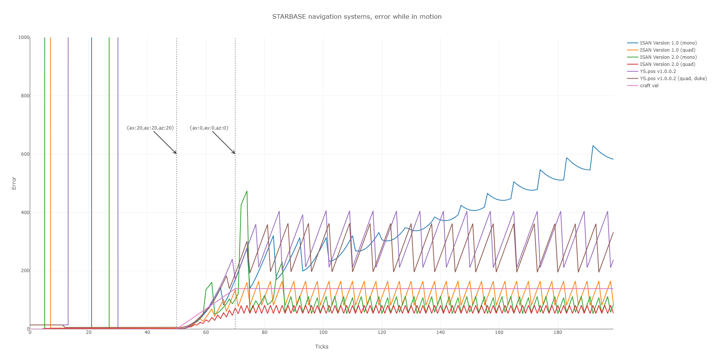

# ISAN
**Integrated System for Autonomous Navigation** in [STARBASE](https://www.starbasegame.com/)

Under development by the Collective, ISAN uses in-game station transmitters as reference points, in order to calculate your relative position. This is the private home of that project.

## What's new in V2?

The first version of ISAN only allows for the use of four hard-coded transmitters, limiting its effectiveness to the range of them. Version two solves the general case, such that you can use any set of four transmitters in range of your ship for positioning, provided you know their position. Additional core modules are under development which will automatically select the closest usable transmitters to your ship.

## Things to see
- [Feature list](docs/Features.md)
- [Under the Hood of ISAN v2](docs/Under%20the%20hood.md)
- [how to contribute](Contributing.md)

## Error of various systems while in motion

## Credits

| Subroutine | Contribution |
|-|-|
|[Solon](https://github.com/1Solon "Solon#4472 on Discord")|Project management
|[Azurethi](https://github.com/Azurethi "Azurethi#0789 on Discord")|ISAN V2 math & code, repo management ‘The V2 guy’
|[Lumi](https://github.com/Lumi-Virtual "Lumi Virtual#9704 on Discord")|Development of ISAN V1 ‘ISAN alchemist’
|[Recatek](https://github.com/Recatek "Recatek#1707 on Discord")|Code minification, Lighthouse protocol
|[Strikeeaglechase](# "Strikeeaglechase#0001 on discord")|Development of V1 offsets and Autopilot
|MuNk|Code consultation
|Nordwolf|Coordinate system calculation and measurements, Dev of ISAN V0
|Battle_Wrath|Various design ideas and general help|
|Archduke|Support and document writeup|
|Zaff|Security and usability consultation, Documentation|
|Meboy100|Le rubber duck|

*hover for discord usernames, click for githubs*

