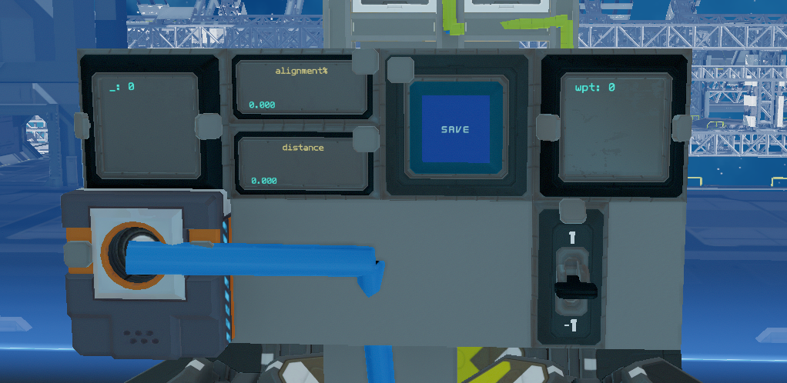

# ISAN: Navigator Bundle!

## install:

Paste the code from ``ISAN-navigator_bundle.yolol`` and ``addon-waypoint_store.yolol`` into **ADVANCED** yolol chips

Add two memory chips to a relay, set up as below (fields without arrows don't need to be relayed)

```
x
y
z
m
n
o
p
e -> alignment%
f -> distance
```

Create a UI panel like so:

 - the button and switch are both style 1
 - the switch output is named ``ws``

## Version history

- V1.0: Built off ISAN Basic Bundle v2.5.2
    ```diff
    + Spawned from basic_bundle V2.5.2
    + Re-added alignment feature
    + Implemented Waypoint Store addon
    ```