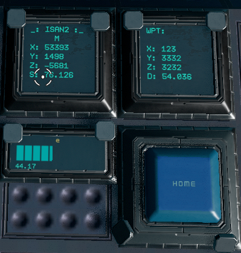

# ISAN: Navigator Bundle!

## Hardware Requirements
• 1 Basic and 1 Advanced YOLOL Chips (2 Advanced if speed is enabled)
• YOLOL Memory Chip with fields m, n, o, and f
• Progress bar named 'e' with range 0 to 100
• Two display screens named '_' and 'WPT'
• Button named 'Home'



## Version history

- V1: Built off ISAN Basic Bundle v2.5
    ```diff
    + Waypoint entry chip
        • Write coordinates to memory chip via display
        • Displays distance to waypoint in kilometers
    + Added Alignment feature
        • Easily line up with target point
    + Requires YOLOL Memory chip or other storage fields
        • Required fields: m, n, o, and f
    ```
