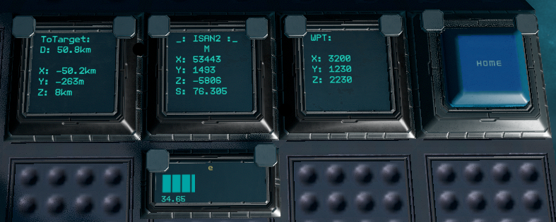

# ISAN: Navigator Plus Bundle!

## Hardware Requirements
• 1 Basic and 2 Advanced YOLOL Chips (3 Advanced if speed is enabled)
• YOLOL Memory Chip with fields x, y, z, m, n, o, and f
• Progress bar named 'e' with range 0 to 100
• Three display screens named '_', 'WPT', and 'ToTarget'
• Button named 'Home'



## Version history

- V1: Built off ISAN Navigator Bundle v1
    ```diff
    - Distance on WPT display
        • Moved to ToTarget display
    + Detailed X, Y, Z, and Total distances
        • Automatically switch to kilometers when distance over 1,000m
    + Requires ISAN memory mode
        • Uses fields x, y, and z
        • Also requires fields m, n, o, and f from ISAN Navigator
    ```
